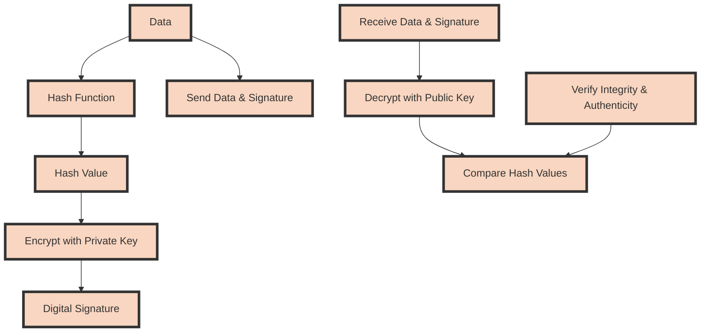

## 物联网三层体系

### 感知层
#### 1.概述
物联网的最底层，负责识别物体和采集信息。它包括各种传感器、RFID标签和读写器、二维码标签以及其他感知设备。这些设备能够感知环境中的各种数据，如温度、湿度、光照强度等，并将其转化为电子信号。
#### 2.安全威胁
- **物理攻击**：攻击者可能直接对设备进行物理破坏或篡改，以获取敏感信息或植入恶意代码。
- **身份伪装**：攻击者通过伪造身份，绕过认证机制，非法接入网络或设备。
- **拒绝服务（DoS）攻击**：通过大量无效请求使设备或网络资源耗尽，导致合法用户无法访问服务。
#### 3.应对策略
- **认证技术**：采用轻量级公钥、预共享密钥、随机密钥预分布、辅助信息和基于单向散列函数的认证，确保节点身份和数据真实性。
- **容侵容错技术**：设计网络拓扑，增强网络的健壮性；在网络部分节点失效时，通过补充节点维持监测区域覆盖；确保恶劣环境下数据准确获取。
### 网络层
#### 1.概述
负责传输感知层获取的信息，实现数据的双向传送、路由和控制。网络层包括各种无线和有线网络以及互联网和私有网络。网络层的任务是将感知层的数据传递给应用层，并可能进行初步的数据融合和处理。
#### 2.安全威胁
- **多网融合的路由问题**：物联网跨越多种网络，需要解决不同网络间的路由兼容性。
- **传感器网络的路由安全**：传感器网络特有的路由算法容易遭受中间人、黑洞和欺骗攻击。
- **统一协议栈需求**：缺乏统一的协议栈和标准可能引入协议漏洞，影响网络安全。
#### 3.应对策略
- **安全路由协议**：开发针对物联网的路由技术，如洪泛式路由、数据为中心的路由、层次式路由和基于位置信息的路由，提高网络鲁棒性，防范攻击。
### 应用层
#### 1.概述
物联网和最终用户或业务逻辑的接口。应用层负责解析和处理网络层传递过来的数据，提供给用户或行业应用。它包括各种物联网应用和服务，还可能包含数据分析、数据存储、用户界面以及与其他系统的集成。
#### 2.安全威胁
- **隐私泄露**：敏感信息在数据挖掘和决策过程中可能被不当获取。
- **控制安全**：第三方控制的应用中，物体控制的可靠性和安全性成为问题。
- **终端安全接入**：终端设备的不安全配置可能成为攻击入口。
#### 3.应对策略
- **数据处理隐私保护**：在数据采集、存储和挖掘中实施加密和匿名化技术，保护用户隐私。
- **决策与控制安全**：研究物体控制的安全性和可靠性，确保数据从感知端到决策控制全程安全，防止未授权的干预和操作。
## 数据加密
数据加密是保护信息的一种可靠方法，它使用密码技术对信息进行交换和存储，以加密格式处理敏感数据，防止物理或网络窃听。加密确保信息在传输过程中的安全性，即使数据被截取也无法被理解。
### 对称加密

#### 1.加密原理
- 对称加密使用相同的密钥进行加密和解密，这意味着发送方和接收方都必须拥有相同的密钥。
#### 2.优点
- **加密解密速度快**：由于算法设计简单，对称加密算法的处理速度较快，适用于大数据量的加密。
- **资源消耗低**：对称加密算法通常较为高效，所需的计算资源较少。
#### 3.缺点
- **密钥管理困难**：对称加密的主要问题是密钥的安全分发。如果密钥被第三方获取，加密信息就不再安全。
- **可扩展性差**：随着用户数量的增加，密钥的管理和分发变得越来越复杂。
### 非对称加密

#### 1.加密原理
- 非对称加密使用一对密钥，即公钥和私钥。公钥用于加密，私钥用于解密。公钥可以公开，而私钥必须保密。
#### 2.优点
- **密钥管理简单**：非对称加密==简化了密钥管理==，因为公钥可以公开分享，而私钥保持秘密。
- **安全性高**：非对称加密算法的安全性通常高于对称加密，因为即使公钥被截获，信息仍然可以通过私钥解密。
#### 3.缺点
- **加密解密速度慢**：非对称加密算法的处理速度比对称加密慢，不适合大数据量的加密。
- **计算资源消耗高**：非对称加密算法的计算复杂度较高，因此对计算资源的需求也更大。
### 应用场景
- **对称加密**：适用于需要高速加密的大数据量场景，如文件加密、数据传输加密。
- **非对称加密**：适用于密钥安全交换、数字签名和身份认证等场景，尤其是当通信双方首次接触时，非对称加密可以*安全地交换对称加密的密钥*。
### 实际应用
在实际应用中，通常会结合使用对称加密和非对称加密，以充分利用它们各自的优点。例如，在安全套接层/传输层安全（SSL/TLS）协议中，非对称加密用于安全地交换对称加密的密钥，之后的通信则使用对称加密来进行高效的数据传输加密。这种方式既能保证通信的安全性，又能保持良好的加密解密速度。
### 秘密
- **对称加密**：密钥
- **非对称加密**：私钥
### n个用户
- 在对称加密体系中，假设有$n$个用户，每两个用户之间需要一个单独的密钥进行安全通信，因此整个系统需要的密钥总数遵循组合数学中的无重复组合原则
$$
\text{对称加密体系密钥总数} = \frac{n(n-1)}{2}
$$

* 在非对称加密体系中，每个用户都有一对密钥，即一个公钥和一个私钥。因此，对于$n$个用户，整个系统需要的密钥总数是每个用户一对密钥乘以用户总数
$$
\text{非对称加密体系密钥总数} = 2n
$$
## 公钥加密（非对称密钥）
在公钥加密（非对称密钥）体系中，加密和解密过程涉及一对匹配的密钥，即公钥和私钥。公钥可以公开发布，而私钥则由用户自己秘密保存。公钥用于加密，私钥用于解密，这种特性使得信息的发送方能够使用接收方的公钥加密消息，而只有接收方能用其私钥解密，反之亦然。此机制不仅提供了安全的通信渠道，还奠定了数字签名的基础，以确保信息的来源和真实性。

`在A向B发送加密信息的场景中`：
### 加密
当A想要向B发送加密信息时，A使用B的公钥来加密信息。由于公钥加密的文件只能用私钥解密，B可以使用自己的私钥来解密信息，确保了信息的机密性。
### 数字签名
#### 1.概念
- 数字签名是一种安全措施，用于确认文件或信息的来源和验证其在传输过程中的==完整性==。

- 基于单向函数生成的字母数字串，能够防止信息篡改和发送者抵赖行为的发生。

- 发送方A使用自己的**私钥**对信息进行加密处理，形成数字签名，然后将签名附加在原始信息上一起发送给接收方B。
#### 2.作用
- **鉴权**: 数字签名能让接收方B确认信息确实来自发送方A，增强了身份验证。
- **完整性**: 即使第三方能读取或修改加密信息，数字签名能够确保信息在传输过程中未被篡改。
- **不可抵赖**: 接收方B可以通过验证数字签名来防止发送方A后续否认发送过该信息，因为数字签名是基于A的私钥生成的，除非A泄露了自己的私钥，否则只有A才能生成这样的签名。

#### 3.实现
数字签名依赖于公钥加密技术，即接收方B使用A的公钥来验证数字签名，以确保签名的合法性和信息的真实性。

这是一个使用Mermaid语法表示的流程图，描述了数据加密和数字签名的流程。首先，原始数据（`Data`）通过哈希函数（`Hash Function`）生成哈希值（`Hash Value`）。接着，使用私钥（`Encrypt with Private Key`）对哈希值进行加密，形成数字签名（`Digital Signature`）。原始数据和数字签名一起发送（`Send Data & Signature`）。接收方接收数据和签名（`Receive Data & Signature`），使用公钥（`Decrypt with Public Key`）解密数字签名并得到原始哈希值。接收方对数据应用同样的哈希函数，比较生成的哈希值与解密的哈希值（`Compare Hash Values`），以此验证数据的完整性和来源的真实性（`Verify Integrity & Authenticity`）。
### 公钥基础设施

* **PKI**：公钥基础设施
* **WPKI**：无线公钥基础设施
## 信任体系
数字签名、数字证书和认证机构构成了一个**完整的信任模型**，确保了网络通信的安全性。**数字签名**提供数据完整性和不可抵赖性，**数字证书**保证了公钥的真实性，而**认证机构**则作为信任的中介，确保整个系统的运作符合预期。
### 数字签名
   数字签名是一种加密技术，用于验证电子文件的完整性和发送者的身份。它基于非对称加密算法，即公钥和私钥系统。发送者使用自己的私钥对消息摘要进行加密，形成数字签名。接收者可以使用发送者的公钥解密这个签名，以验证签名的合法性和消息是否被篡改。
### 数字证书
   数字证书是一种*电子文档*，用于证明公钥属于某个实体。它包含了`实体的身份信息`、`公钥`以及`签发该证书的认证机构的数字签名`。数字证书确保了公钥的所有者就是证书中声称的人或组织，从而增强了信任度。数字证书通常包含==有效期==，过了有效期后，证书失效，不再有效。
### 认证机构(CA)
   认证机构是**第三方实体**，负责验证和签发数字证书。当一个实体申请数字证书时，CA会执行一系列的身份验证过程，确认申请者的真实身份。一旦验证完成，*CA会用自己的私钥为申请者签发数字证书*，这相当于CA为该实体的公钥提供了一种保证。因此，任何信任该CA的人都可以信任由该CA签发的数字证书。
### 三者之间的关系

- **数字签名依赖于数字证书**：数字签名的有效性取决于接收者是否能够获取到正确的公钥来验证签名。数字证书提供了这种公钥的可靠来源，它保证了公钥与特定实体之间的联系。

- **数字证书依赖于认证机构**：数字证书的可信度来源于认证机构的信誉。如果接收者信任某个CA，那么他们也就会信任由该CA签发的数字证书，进而信任证书中所包含的公钥。

- **认证机构建立信任链**：CA通过其自身的数字证书建立起信任链。顶级CA(根CA)的证书通常预装在操作系统或浏览器中，这些根证书被默认信任。其他下级CA则从根CA获得信任，形成了一个信任层级结构。
## 完整性保护
### CRC-无加密
### MIC-对称加密
### 数字签名（鉴权）-非对称
## 认证与控制

身份认证和访问控制是网络安全的基石，而口令管理是其中不可或缺的一环。通过实施严格的口令政策和采用先进的认证技术，可以有效地降低口令攻击的风险，保护系统和数据的安全。
### 身份认证
身份认证是确保用户身份真实性的过程，它在物联网和其他网络系统中起到至关重要的作用。认证可以基于用户所知道的（如口令、密码）、所拥有的（如智能卡、USB密钥）或本身具有的特征（如指纹、虹膜扫描等生物特征）。在物联网中，认证技术可能包括：

- **多因素认证**：结合两种或以上认证方法，提高安全性。
- **动态口令**：一次性口令，常用于二次验证。
- **生物特征识别**：利用个体独特的生理或行为特征进行认证。
- **单点登录（SSO）**：用户仅需登录一次即可访问多个应用或服务。
### 访问控制和口令
访问控制机制定义了用户对资源的访问权限，它确保只有授权用户能够访问特定信息或执行特定操作。口令管理是访问控制的一个重要方面，涉及到口令的创建、存储、验证和更新。
#### 1.口令攻击
口令攻击包括网络数据流窃听、认证信息截取重放、字典攻击、穷举攻击、窥探和社会工程等。为了增强安全性，建议使用特殊字符和长口令，避免与个人信息相关的简单密码。

综上所述，数据加密、身份认证、访问控制、口令安全、数字证书、电子签证机关（CA）和数字签名是信息安全领域的关键技术，它们在保护数据、验证身份和确保网络资源安全方面发挥着重要作用。$$E_{k}(m) = c$$ 其中，$E_{k}$ 表示加密函数，$m$ 是明文消息，$k$ 是密钥，$c$ 是密文。在非对称加密中，$E_{pub}(m) = c$，$D_{pri}(c) = m$，这里$pub$代表公钥，$pri$代表私钥。数字签名则通过$S_{pri}(m) = s$生成，$V_{pub}(s, m) = true$验证，$S_{pri}$是签名函数，$V_{pub}$是验证函数。

常见的口令攻击类型包括：

- **暴力破解**：尝试所有可能的组合，直到找到正确的口令。
- **字典攻击**：使用常见的单词或短语列表尝试匹配口令。
- **混合字典攻击**：结合字典中的词汇与数字或符号，增加猜测的复杂度。
- **社会工程**：利用心理学技巧诱骗用户透露口令。
#### 2.防护手段
为了抵御口令攻击，可以采取以下策略：

- **强口令政策**：要求使用复杂的口令，包含大小写字母、数字和特殊字符。
- **口令生命周期管理**：定期更改口令，限制其有效期限。
- **多因素认证**：结合口令与其他认证方法，如生物特征或硬件令牌。
- **教育和培训**：提高用户对安全实践的意识，避免社会工程攻击。
- **口令哈希存储**：不存储明文口令，而是存储其哈希值，即使数据库被攻破，口令也不会直接泄露。

### 重放攻击
重放攻击（Replay Attack）是一种网络安全攻击手段，攻击者通过**捕获网络中传输的有效数据包，然后在之后的时间重复发送这些数据包，以此来欺骗系统或网络**，达到未经授权的访问、操纵数据或进行其他恶意行为的目的。攻击者不需要理解数据的真实内容或破解加密，只需简单地重新发送数据即可尝试利用系统或协议中的漏洞。

防止重放攻击的常见方法包括：

1. **时间戳（Timestamp）**：在数据包中加入时间戳，并要求接收方验证数据包的时间戳是否在合理的范围内，从而拒绝过时的请求。这要求系统之间有较为精确的时间同步。

2. **随机数（Nonce）**：在每一次请求中加入一个一次性使用的随机数（Number used once），接收方记录并检查之前是否已经接收过相同的随机数，以防止相同请求的重放。

3. **序列号（Sequence Number）**：在数据包中包含递增的序列号，接收方根据序列号的连续性判断请求的有效性，不连续的序列号会被视为无效。

4. **会话密钥（Session Keys）**：为每个会话生成新的密钥，过期或非预期的会话密钥将被拒绝。

5. **挑战-响应（Challenge-Response）**机制：服务器向客户端发送一个挑战（如随机数），客户端需要用私有信息（如密钥）计算响应并返回，以此证明请求是新鲜的而非重放。

6. **数字签名**：使用消息认证码（MAC）或数字签名确保消息的完整性和来源真实性，可以结合时间戳或序列号以防止重放。

7. **双因素认证或多因素认证**：结合密码以外的认证因素（如物理令牌、生物特征、短信验证码等），即使攻击者重放密码，也无法通过其他认证环节。

综合运用上述策略可以有效提升系统的抗重放攻击能力，但具体选择哪种或哪几种方法，需根据系统的实际需求、性能要求和安全等级来决定。